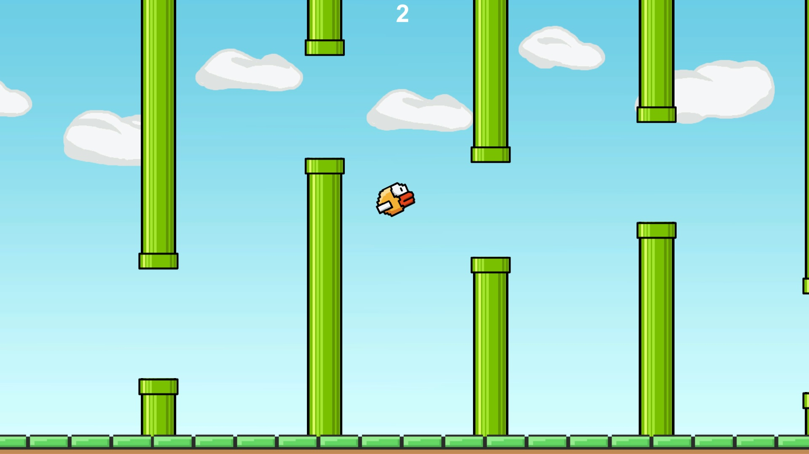

# Flappy Bird Remake
## User Guide
#### Introduction
This game is a lightweight remake of an infamous Flappy Bird game! It solely focuses on the Flappy Bird game experience!




#### Installation
There is actually no installation needed. You can simple navigate to _FlappyBird\FlappyBird\_Unity\_Project\Build\Windows\x86_ and there is a _Flappy Bird.exe_ file. 

Just make sure the folder Flappy Bird_Data is in the same directory as the Flappy Bird.exe file.

#### Game Controls
You can play the game using the primary mouse button or the spacebar.


## Technical Part
#### Introduction
Instead of moving the bird to the right, I decided to fix bird's x position and move everything else to the left. In this way, there is no need to move the camera. It can stay on a fixed position for the whole game.


#### Scripts Description
There is 5 scripts in total. They can be found under _FlappyBird\FlappyBird\_Unity\_Project\Assets\Scripts_.
* Level
* Bird
* GameAssets
* Score
* SoundHandler

I will briefly describe what the main purpose of these scripts is and then point out some interesting information about the way they handle some problems.

##### Level
* Takes care of moving the scene - pipes, ground, clouds
* Manages in game states  
    * Bird is flying and alive
    * Bird is dead
* Updates score

Ground and pipes are moved to the left in the same constant speed. Clouds are moved a little slower. This creates a nice parallex effect.

If the bird dies, the Bird class triggers an event. To this event is subscribed a function level\_OnDied in a  Level class. This way Level class knows in which state the game should be in.

##### Bird
* Manages bird movement
    * Jumping
    * Rotating
* Detects collisions

Jumping is done simply by changing bird's rigidBody's velocity positively in y direction by some constant jump factor.

Rotating is done by [_Quaternion.Slerp()_](https://docs.unity3d.com/ScriptReference/Quaternion.Slerp.html) function. The t parameter (interpolation ratio) is smoothly changed by bird's velocity. If the bird has a high downward velocity, rotation moves faster to quaternion B, if upward, it moves faster to quaternion A. 

Collision detection is solved by 2D box colliders.

##### GameAssets
* Keeps textures, prefabs, sounds etc ... in the same place, nice and organized

This script's fields have to be visible across other scripts (such as SoundHandler or Level) but it cannot be static, because you want to create instances. This problem is solved by a public static function _GetInstance()_,

```
public static GameAssets GetInstance()
{
    return instance;
}
```

that returns an instance of the class itself (GameAssets).

```
private static GameAssets instance;
```

This instance is set to _this_ in _Awake()_.

```
private void Awake()
{
    instance = this;
}
```

This paradigma is used in other scripts as well (Level, Bird).

##### Score
* Actively waits for the score to change, then updates it

In Unity, the Score game object is an UI element and a child of Canvas with render mode set to overlay. It is also anchored in the top middle of the Canvas. Thanks to this, the Score text component will always stay nicely anchored in the same position, even if the window size changes.

##### SoundHandler
* Handles all the sound effects

There is no need to create instances of this class and it has to be visible from other scripts, therefore it's static.

Overtime, it deletes unneccesary AuidoSource game objects.


#### Communication Between Scripts 
* Level
    * GameAssets
    * SoundHandler
    * Bird
* Bird
    * SoundHandler
* Score
    * Level
* SoundHandler
    * GameAssets


